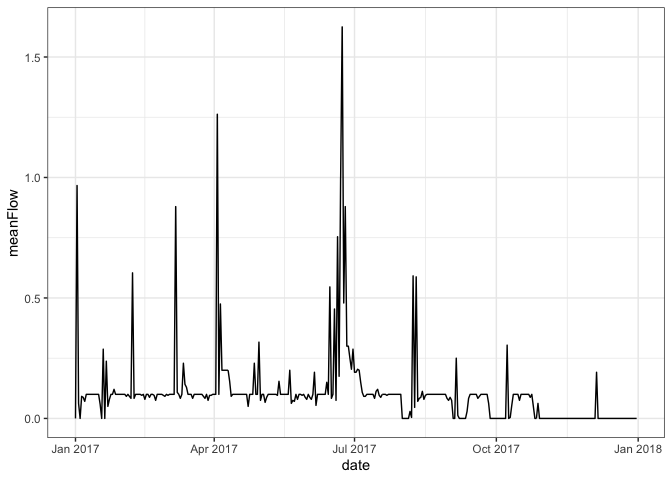

<!-- README.md is generated from README.Rmd. Please edit that file -->

# nwmHistoric 

<!-- badges: start -->

<!-- badges: end -->

## Installation

    #> Loading nwmHistoric
    #> 
    #> Attaching package: 'dplyr'
    #> The following objects are masked from 'package:stats':
    #> 
    #>     filter, lag
    #> The following objects are masked from 'package:base':
    #> 
    #>     intersect, setdiff, setequal, union
    #> USGS Support Package: https://owi.usgs.gov/R/packages.html#support

## Basic use

Lets find the historic flows nearest my home:

``` r

pt  = AOI::geocode('University of Alabama', pt = TRUE) 
comid = nhdplusTools::discover_nhdplus_id(pt)
nhd = HydroData::findNHD(comid = comid)
#> Returned object contains: 1 nhd flowlines

aoi_map(pt, returnMap = TRUE) %>% addPolylines(data = nhd$nhd)
#> Warning: sf layer has inconsistent datum (+proj=longlat +ellps=GRS80 +towgs84=0.0,0.0,0.0,0.0,0.0,0.0,0.0 +no_defs).
#> Need '+proj=longlat +datum=WGS84'
```


``` r
out = extract_retro_url(comid = comid)

head(out)
#>   model    comid            time_utc flow year month day hour
#> 1 NWM20 18228721 1993-01-01 00:00:00  0.2 1993    01  01   00
#> 2 NWM20 18228721 1993-01-01 01:00:00  0.2 1993    01  01   01
#> 3 NWM20 18228721 1993-01-01 02:00:00  0.2 1993    01  01   02
#> 4 NWM20 18228721 1993-01-01 03:00:00  0.2 1993    01  01   03
#> 5 NWM20 18228721 1993-01-01 04:00:00  0.2 1993    01  01   04
#> 6 NWM20 18228721 1993-01-01 05:00:00  0.2 1993    01  01   05
dim(out)
#> [1] 219144      8
```

``` r

sub = extract_retro_url(comid = comid, 
startDate = "2017-01-01", endDate = "2017-12-31")

head(sub)
#>   model    comid            time_utc flow year month day hour
#> 1 NWM20 18228721 2017-01-01 00:00:00    0 2017    01  01   00
#> 2 NWM20 18228721 2017-01-01 01:00:00    0 2017    01  01   01
#> 3 NWM20 18228721 2017-01-01 02:00:00    0 2017    01  01   02
#> 4 NWM20 18228721 2017-01-01 03:00:00    0 2017    01  01   03
#> 5 NWM20 18228721 2017-01-01 04:00:00    0 2017    01  01   04
#> 6 NWM20 18228721 2017-01-01 05:00:00    0 2017    01  01   05
dim(out)
#> [1] 219144      8

sub_daily = sub %>% 
  group_by(year,month,day) %>% 
  summarise(meanFlow = mean(flow)) %>% 
  mutate(date = as.Date(paste(year,month,day,sep = "-")))

ggplot(data = sub_daily, aes(x = date, y = meanFlow, group = 1)) +
  geom_line() + 
  theme_bw() 
```



# Collaborators:

[Mike Johnson](https://mikejohnson51.github.io/)

[David
Blodgett](https://www.usgs.gov/staff-profiles/david-l-blodgett?qt-staff_profile_science_products=3#qt-staff_profile_science_products)

[Pat Johnson](https://overdodactyl.github.io/)

# Support:

This effort is supported by the Consortium of Universities for the
Advancement of Hydrologic Science, Inc. under the HydroInformatics
Fellowship. See program
[here](https://www.cuahsi.org/data-models/hydroinformatics-innovation-fellowship/)
